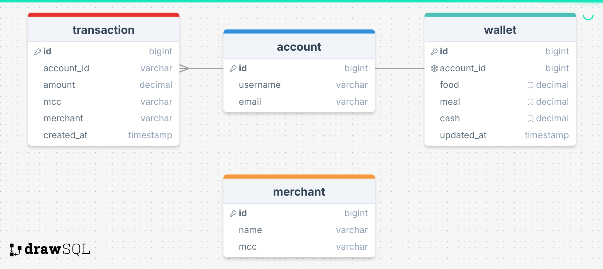

# Cashew

Esse projeto foi criado para resolução
do [Desafio Técnico](https://caju.notion.site/Desafio-T-cnico-para-fazer-em-casa-218d49808fe14a4189c3ca664857de72) da
Caju.

## Índice

- [Decisões técnicas](#decisões-técnicas)
- [Ferramentas](#ferramentas)
- [Executando a aplicação e comandos úteis](#Executando-a-aplicação-e-comandos-úteis)
- [Collections](#collections)
- [Questoes do desafio](#questoes-do-desafio)
    + [L3 Dependente do comerciante](#L3-dependente-do-comerciante)
    + [L4. Questão aberta](#L4-questão-aberta)

## Decisões técnicas

O aplicativo é uma API REST que representa as operações de transações.
Não estava claro no enunciado, porém para facilitar a utilização das funcionalidades foram criados endpoints para
visualização e, em alguns casos, cadastrar das entidades necessárias como conta(Account), transação(Transaction) e
carteira(Wallet).

O desenho da solução leva em conta que cada account tem uma wallet e possíveis transactions.
Na criação de account e criada uma wallet conjuntamente.
Cada transaction valida modifica o valor de um benefício contido na wallet.
A referência do benefício a ser alterado vem do mcc. Existe um mecanismo de correção caso seja informado
equivocadamente o mcc da categoria do estabelecimento.

Ao iniciar o aplicativo, por opção, toda a base de dados e reconfigurada com o estado operacional inicial.
Esse estado tem uma account, como esperado uma wallet e sem transactions
Assim, criando uma flexibilidade para replicar cenários.

Sobre a base de código. Foi focado no enunciado do teste para evitar over engineering.
Não foram usadas bibliotecas, como ORM's, na tentativa de manter a simplicidade da solução.

Os termos das instâncias nos parágrafos acima estão em inglês, como wallet ao invés de carteira, para ficar alinhado ao
domínio implementado na base de código.

Segue a modelagem do banco de dados:


---

## Ferramentas

Segue a lista das principais ferramentas utilizadas no desenvolvimento:

- [Kotlin](https://github.com/JetBrains/kotlin) - Linguagem de programação multiparadigma usada na constução da
  aplicação.
- [Kotlin-test](https://kotlinlang.org/api/core/kotlin-test/) - Biblioteca de testes que fornece anotações para marcar
  funções de teste e um conjunto de funções utilitárias para realizar asserções em testes, independentemente da
  estrutura de teste usada.
- [Arrow-core](https://arrow-kt.io/) Biblioteca funcional que fornece as principais construções do mundo FP.
- [Ktlint](https://github.com/pinterest/ktlint) Lint.
- [Kotlinx-serialization-json](https://github.com/Kotlin/kotlinx.serialization) - Plugin do compilador para serialização
  de classes e suporte a vários formatos de serialização.
- [Hikari](https://github.com/brettwooldridge/HikariCP) - JDBC connection pool.
- [Postgresql](https://jdbc.postgresql.org/) - Driver JDBC de código aberto para o banco de dados PostgresSql.
- [Gradle](https://gradle.org/) - Ferramenta de build.

---

## Executando a aplicação e comandos úteis

É necessário a instalação do Java e adição do mesmo nas variáveis de ambiente para que o Gradle funcione plenamente.

Para subir a instancia com o banco de dados execute o comando abaixo.
__Atencao! Este passo e necessario para rodar a aplicacao e parte da suite de testes.__

```console
docker-compose up
```

Executar a aplicação:

```console
./gradlew run
```

Executar suite de testes:

```console
./gradlew test
```

"Buildar":

```console
./gradlew build
```

Ou se preferir executa os comandos acima via IDE.

---

## Collections

Na pasta collection, localizada na raiz do projeto, tem collections dos softwares Bruno e Postman.

Segue abaixo os comandos cURL:

```console
curl --request GET \
--url http://127.0.0.1:8080/api/accounts
```

```console
curl --request POST \
--url http://127.0.0.1:8080/api/accounts/new \
--data '{
"username": "Johan Cruijff"
}'
```

```console
curl --request GET \
--url http://127.0.0.1:8080/api/wallets
```

```console
curl --request GET \
--url http://127.0.0.1:8080/api/transactions
```

```console
curl --request POST \
--url http://127.0.0.1:8080/api/transactions/new \
--data '{
"accountId": 1,
"amount": 50.0,
"merchant": "test",
"mcc": "5811"
}
```

## Questões do desafio

### L3 Dependente do comerciante

A solução adotada foi criar uma tabela no banco de dados que contem o registro do estabelecimento com o respectivo
mcc correto. Assim, caso seja feita uma transação com o mcc informado incorretamente, a solução vai recuperar o mcc
correto previamente armazenado.

### L4 Questão aberta

Nas descrição do desafio foi levantada a questão reproduzida abaixo:

"A seguir está uma questão aberta sobre um recurso importante de um autorizador completo (que você não precisa
implementar, apenas discuta da maneira que achar adequada, como texto, diagramas, etc.).

- Transações simultâneas: dado que o mesmo cartão de crédito pode ser utilizado em diferentes serviços online, existe
  uma pequena mas existente probabilidade de ocorrerem duas transações ao mesmo tempo. O que você faria para garantir
  que apenas uma transação por conta fosse processada em um determinado momento? Esteja ciente do fato de que todas as
  solicitações de transação são síncronas e devem ser processadas rapidamente (menos de 100 ms), ou a transação atingirá
  o timeout."

Segue resposta:

Separando soluções para a pergunta em tópicos.

- Método 1 - Validação:

As transações são registradas em uma tabela no banco de dados.
Toda nova transação será revisada chegando a existência da mesma, indo ao banco de dados na tabela anteriormente
citada.
Um cenário de inundação de requisição expõe o problema desse método. Solicitações simultâneas, com o mesmo payload,
em questão de frações de segundos, aumenta a possibilidade de registro duplicado da transação no sistema.
A janela de tempo para recuperar as informações no baco de dados é o suficiente para possibilitar a criação
acidental de registros indesejados.

- Método 1 - Locking:

A implementação é bastante semelhante ao método acima, no entanto, em vez de um banco de dados transacional tabelar,
poderíamos optar por armazenar em memória, como o Redis. Infelizmente, mesmo com esse método, ainda existe possibilidade
acidentalmente da criação registros indesejados. Consultas na memória, que é mais veloz que a consulta no banco de
dados, ainda são lenta o suficiente para registrar duplicatas.

- Método 3 - Queuing:

A ideia aqui é enfileirar todas as solicitações recebidas em uma fila e um consumidor processar as solicitações em
determinado ritmo. Assim daria para validar e processar cada solicitação recebida adequadamente.
O problema com esse método é que aumentamos a complexidade da nossa solução.

- Método 4: Tabelas de banco de dados com UNIQUE constrain:

A ideia é modelar sua tabela no banco de dados com algum campo identificador com UNIQUE constrain. O banco dedados nos
ajuda não salvando registros com o mesmo identificador, garantindo a atomicidade da transação.
O problema com esse método é que quanto mais distribuídos esses dados estão, aumenta a complexidade. Por exemplo,
se já é utilizada alguma estratégia de sharding na sua base de dados, é necessário soluções para adequação
arquitetônica, como identificador único universal para identificar as transações.

Dados os métodos com seus trade-offs, em cenários de microserviços, eu iria com o método 3. 
Caso fosse algo mais monolítico e em uma escala mais inicial, o método 4 poderia se encaixar como solução.    
Fica a observação que em cenários reais precisamos de muitas outras variáveis, que muita das vezes ultrapassa
analises técnicas, para escolher o caminho possível ideal.